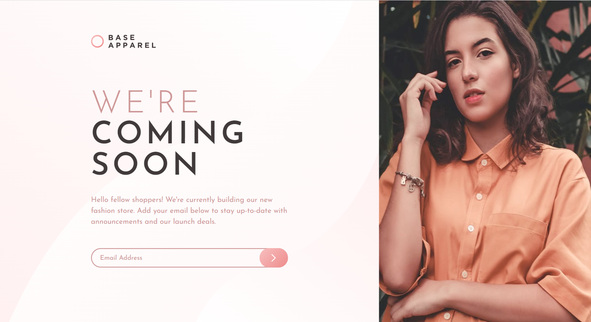

# Frontend Mentor - Base Apparel coming soon page solution

This is my personal solution to the [Base Apparel coming soon page challenge on Frontend Mentor](https://www.frontendmentor.io/challenges/base-apparel-coming-soon-page-5d46b47f8db8a7063f9331a0). Frontend Mentor challenges help you improve your coding skills by building realistic projects, they provide you with a jpg of what it should look like at each viewport width and then you write the code to make the design a functional website.  

## Heres are a few features of my website / component

* Mobile first design as to be inline with Googles mobile first indexing best practices in relation to SEO.
* The page is made responsive, with CSS flex and a breakpoint for viewports over 1000px wide, but more could be added in the future.
* CSS variables added for colors that are re-used on multiple elements, this way the color scheme can be changed easily.
* Rems are used as the prefered unit of measure. 
* I wrote Javascript functions to handle custom form validation of the users input into the email field,
the function works on input and toggles on the related error css classes until the user correctly enters a valid email syntax.

## Table of contents

  - [Screenshot](#screenshot)
  - [Links](#links)
  - [Built with](#built-with)
  - [Author](#author)

### Screenshot
##### Desktop View - Below (1440px viewport width)

##### Mobile View - Below (375px viewport width)

### Links

- Solution URL: [https://github.com/jacksen30/Coming-soon-with-waitlist-form]
- Live Site URL: [https://landing-page-with-waitlist.netlify.app/]

### Built with

- Semantic HTML5 markup
- CSS 3
- CSS FLEX layout for contents of the landing page
- Javascript ES6 

## Author

- Website - [Jacksen Nillson](https://devbyjacksen.com/)
- Frontend Mentor - [@jacksen30](https://www.frontendmentor.io/profile/jacksen30)

